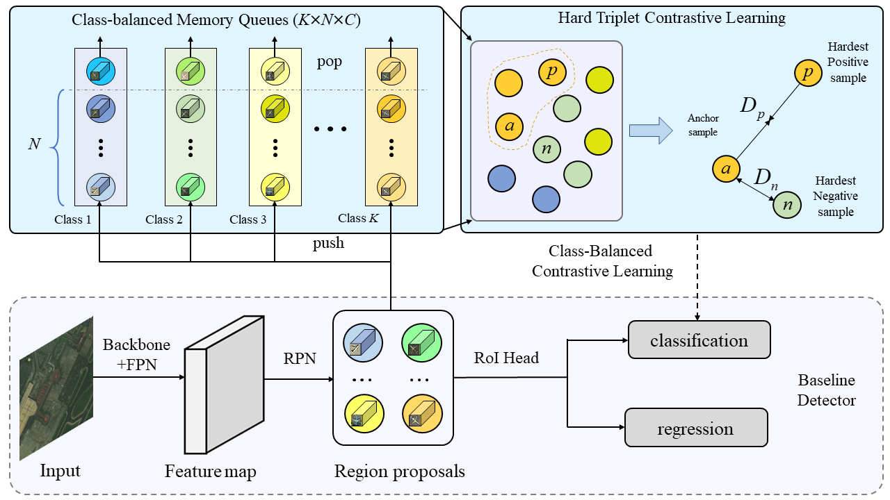

## Introduction

This is the implementation for class-balanced contrastive learning method.

Airplane detection and fine-grained recognition in remote sensing images are challenging due to class imbalance and high inter-class indistinction. To alleviate these issues, we propose class-balanced contrastive learning (CBCL) approach for airplane detection to exploit the correlation between samples in different images, which is rarely explored in previous research. 

The overview of our method is shown as follow:
<div align="center">
  
</div>

The trained model can be found at the [BaiduYun](https://pan.baidu.com/s/1RjT67g7ehq5NJpC3-Bw6iA) (password: fei6), and the corresponding config is [orcnn_cbcl.py](configs/cbcl/orcnn_cbcl.py).

## Installation

This project is developed upon [MMRotate](https://github.com/open-mmlab/mmrotate), please refer to [install.md](docs/en/install.md) to install MMRotate.

We utilized mmcv-full = 1.4.8, torch = 1.9.1+cu111
## Dataset

Obtain the FAIR1M-1.0 dataset from [gaofen challenge](http://gaofen-challenge.com/benchmark).

## Experiments

1. Data preprocessing

Convert label format from XML to TXT.
```shell
python tools/data/fair1m/xml2txt
```
Split and extend the dataset
```shell
python tools/data/fair1m/split/img_split.py --base-json tools/data/fair1m/split/split_configs/ms_trainval.json

python tools/data/fair1m/split/img_split.py --base-json tools/data/fair1m/split/split_configs/ms_test.json
```
2. Train
```shell
CUDA_VISIBLE_DEVICES={gpu_id} bash tools/dist_train.sh {config_path} {gpu_number}
```
3. Test
```shell
CUDA_VISIBLE_DEVICES={gpu_id} bash tools/dist_test.sh {config_path} {checkpoint_path} {gpu_num}
```

## Contributing

We appreciate all contributions to improve MMRotate. Please refer to [CONTRIBUTING.md](.github/CONTRIBUTING.md) for the contributing guideline.

## Acknowledgement

MMRotate is an open source project that is contributed by researchers and engineers from various colleges and companies. We appreciate all the contributors who implement their methods or add new features, as well as users who give valuable feedbacks. We wish that the toolbox and benchmark could serve the growing research community by providing a flexible toolkit to reimplement existing methods and develop their own new methods.

## Citation

If you find this project useful in your research, please consider cite:

```bibtex
@article{GRSL-01473-2022,
  title = {Class-balanced Contrastive Learning for Fine-grained Airplane Detection},
  author= {Yan Li and 
           Qixiong Wang and 
           Xiaoyan Luo and 
           Jihao Yin},
  year  = {2022}
}
```